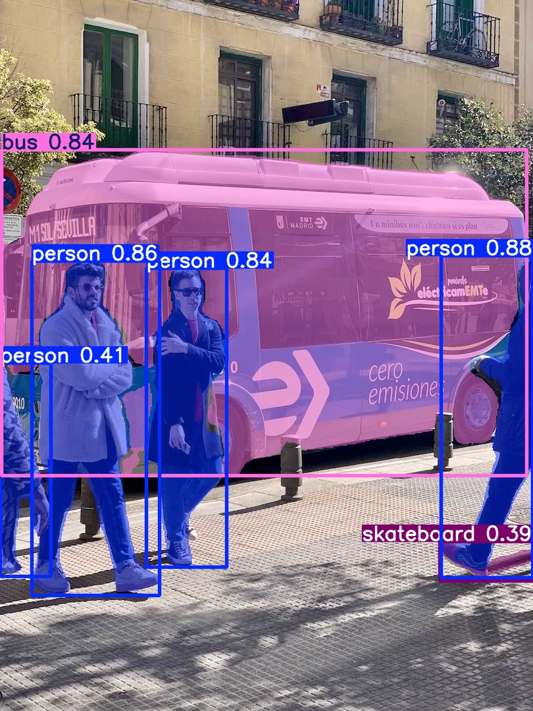

# YOLOv8 Instance Segmentation on VOC2012 (MVP v0.0)

A complete, modular, GPU-ready pipeline for fine-tuning **YOLOv8-seg** (via
[Ultralytics](https://github.com/ultralytics/ultralytics)) on the **Pascal
VOC2012** segmentation dataset — from raw VOC masks to a trained model,
evaluation report, and inference on new images.

This is the **v0.0 MVP**: a complete, working end-to-end pipeline, built to
be extended (more datasets, more advanced tuning, more deployment options)
without needing a rewrite.

---

## Example output



> This sample was produced by `main.py infer` using the **stock
> COCO-pretrained checkpoint** (before VOC fine-tuning) on a stock test
> image, purely to demonstrate the inference pipeline's output format
> (boxes + masks + confidence scores). Replace this image with a sample
> from your own VOC-fine-tuned model once training is complete:
> ```bash
> python main.py infer --source path/to/sample.jpg \
>     --checkpoint training/runs/voc_seg_exp/weights/best.pt \
>     --save-annotated --output-dir docs/
> ```

---

## What this project does

1. **Converts** VOC2012's pixel-mask segmentation labels into YOLO-seg's
   polygon label format (VOC doesn't ship this format natively).
2. **Splits** the data into `train` / `val` / `test` — with `test` held out
   and untouched until a single final, unbiased evaluation.
3. **Fine-tunes** a YOLOv8-seg model on the converted data.
4. **Tunes** hyperparameters via grid search, scored on `val` only.
5. **Evaluates** the model: precision, recall, mAP@50, mAP@50-95 (for both
   boxes and masks), plus supplementary pixel-level IoU/Dice/pixel-accuracy.
6. **Runs inference** on new images, with optional annotated-image export.

---

## Why VOC2012, and why these design choices

- VOC2012 ships with **instance-level** segmentation masks
  (`SegmentationObject/`), which is what an instance-segmentation model
  (YOLOv8-seg) actually needs — as opposed to `SegmentationClass/`, which
  only encodes semantic class, not individual object identity.
- The project follows a **reuse-first** philosophy: we build on
  Ultralytics' YOLOv8 implementation rather than reimplementing a detection
  architecture from scratch. Our own code adds the VOC-specific data
  pipeline, evaluation, and orchestration layers around it.
- **Train / val / test are strictly separated by purpose**, not just by
  file:
  - `train` → model fitting
  - `val` → monitoring + hyperparameter tuning (safe to reuse repeatedly)
  - `test` → touched **once**, for a final, unbiased report

---

## Project structure

```
.
├── main.py                     # MVP entry point (CLI) - ties everything together
├── configs/                    # All configuration - no hardcoded parameters in code
│   ├── voc_seg.yaml            #   VOC paths, split ratios, conversion settings
│   ├── model_config.yaml       #   Model variant, training hyperparameters
│   └── hyperparameter_grid.yaml#   Grid-search space
├── data/                       # VOC -> YOLO-seg conversion pipeline
│   ├── data_pipeline.py        #   Composition root for the data stage
│   ├── dataset_downloader.py   #   Auto-downloads VOC2012 only if not already present
│   ├── voc_paths.py            #   VOC folder layout
│   ├── voc_split_reader.py     #   Reads VOC's official train.txt/val.txt
│   ├── voc_split_plan_builder.py # Builds the train/val/test id plan (policy)
│   ├── dataset_splitter.py     #   Generic list-splitting utility
│   ├── voc_mask_loader.py      #   Loads SegmentationClass/Object PNGs
│   ├── voc_instance_extractor.py # Mask -> polygon + class (core conversion logic)
│   ├── yolo_label_writer.py    #   Writes YOLO-seg .txt labels
│   ├── image_exporter.py       #   Symlinks/copies images into the output layout
│   ├── voc_to_yolo_converter.py#   Orchestrates one split's conversion
│   └── class_mapping.py        #   VOC's 20 classes <-> YOLO class ids
├── models/                     # Model wrapper (encapsulates ultralytics)
│   ├── yolo.py                 #   YOLOSegmentationModel - the only file that imports ultralytics
│   └── model_config.py         #   ModelConfig dataclass
├── training/                   # Hyperparameter tuning
│   ├── hyperparameter_grid.py  #   Builds the grid-search combinations
│   ├── hyperparameter_tuner.py #   Runs + scores each combination (on val only)
│   └── tune_hyperparameters.py #   CLI entry point
├── evaluation/                 # Metrics
│   ├── metrics.py               #  Pure IoU/Dice/pixel-accuracy + result dataclasses
│   └── evaluate.py              #  SegmentationEvaluator - orchestrates evaluation
├── inference/
│   └── inference_codes/
│       ├── inference.py         #  CLI entry point
│       ├── inference_runner.py  #  Orchestrates model.predict() + parsing
│       ├── result_parser.py     #  The only file that knows ultralytics' Results shape
│       └── prediction_result.py #  Framework-agnostic prediction dataclasses
├── tests/                      # 76 tests, all passing - see "Testing" below
└── dataset/                    # VOC2012 source data + converted YOLO-seg output (gitignored)
```

**Design principle throughout:** every external dependency (ultralytics)
is wrapped behind a small number of "boundary" classes (`YOLOSegmentationModel`,
`UltralyticsMetricsParser`, `UltralyticsResultParser`). The rest of the
project only talks to our own dataclasses and interfaces — so a future
framework swap, or a second dataset (COCO, etc.), only touches a few files.

---

## Requirements

- Python 3.10+
- A CUDA-capable GPU is recommended for real training runs (CPU works for
  small-scale testing and inference)

Install dependencies:

```bash
pip install ultralytics pyyaml numpy opencv-python-headless pillow pytest
```

---

## Setup

The dataset is **not** committed to this repo (see [Repo size /
.gitignore](#repo-size--gitignore) below) — `prepare-data` downloads it
automatically the first time you run it, so a fresh clone just works:

```bash
python main.py prepare-data
```

On the first run, if VOC2012 isn't already found at `configs/voc_seg.yaml`'s
`voc_root`, it's downloaded (~2GB) and extracted automatically. Every run
after that detects it's already present and skips straight to conversion —
so it's always safe to re-run `prepare-data`.

If you'd rather provide the data yourself (e.g. a Kaggle-attached dataset,
or you already have it locally), just place it at the expected layout and
`prepare-data` will detect it and skip the download:

```
dataset/VOCdevkit/VOC2012/
├── JPEGImages/
├── SegmentationClass/
├── SegmentationObject/
└── ImageSets/Segmentation/
```

Adjust `configs/voc_seg.yaml`'s `voc_root` / `download_url` if your paths
or preferred mirror differ.

---

## Repo size / .gitignore

The dataset (~2GB), trained weights (`*.pt`), training run logs
(`training/runs/`), and inference outputs are all **gitignored** — keeping
them out of the repo means cloning or forking stays fast and cheap.
`data/dataset_downloader.py` (used by `prepare-data`, see
[Setup](#setup)) is what re-materializes the dataset locally on demand.
The `dataset/` and `inference/inference_output/` folder *paths* are still
tracked (via `.gitkeep`), so the expected project structure is visible
even on a fresh clone.

---

## Usage

Run the full MVP pipeline (data prep → train → evaluate on `val`):

```bash
python main.py all
```

Or run each stage individually:

```bash
# 1. Convert VOC2012 -> YOLO-seg format (train/val/test)
python main.py prepare-data

# 2. Fine-tune
python main.py train

# 3. (Optional) Grid-search hyperparameters — scored on val only
python main.py tune

# 4. Evaluate — use val repeatedly during development
python main.py evaluate --split val

# 5. Evaluate ONCE on test, for your final, unbiased report
python main.py evaluate --split test \
    --checkpoint training/runs/voc_seg_exp/weights/best.pt

# 6. Run inference on new images
python main.py infer --source path/to/image_or_folder \
    --checkpoint training/runs/voc_seg_exp/weights/best.pt \
    --save-annotated
```

Run `python main.py <command> --help` for the full option list of any
subcommand.

---

## Running on Kaggle

Kaggle Notebooks provide a free GPU, so it's a convenient way to run this
pipeline without local hardware. Kaggle's filesystem has two relevant
areas:
- `/kaggle/input/` — **read-only**, where attached datasets live
- `/kaggle/working/` — **writable**, where your repo, outputs, and
  checkpoints should go

### 1. Create a notebook with GPU enabled

New Notebook → **Settings** (right sidebar) → **Accelerator** → choose a
GPU (e.g. T4 x2 or P100). Also make sure **Internet** is turned **On**
under Settings, since you'll need it to `git clone` and to let Ultralytics
download the pretrained checkpoint.

### 2. Clone the repository

In a code cell:

```python
%cd /kaggle/working
!git clone https://github.com/<your-username>/<your-repo>.git
%cd <your-repo>
!pip install -q ultralytics pyyaml numpy opencv-python-headless pillow pytest
```

### 3. Get VOC2012 onto the notebook

`prepare-data` will auto-download VOC2012 to `/kaggle/working/` if you
skip this step entirely — but the official host can be slow from Kaggle,
so attaching a pre-hosted Kaggle dataset (Option A) is usually faster.

Either option works:

**Option A — attach a Kaggle dataset (recommended, faster):**
Click **Add Input** → search for a "Pascal VOC 2012" dataset → add it.
It will appear under `/kaggle/input/<dataset-name>/`. Then point the
pipeline at it instead of copying files, by editing `configs/voc_seg.yaml`:

```yaml
dataset:
  voc_root: "/kaggle/input/<dataset-name>/VOCdevkit/VOC2012"
  output_root: "/kaggle/working/dataset/voc2012_yolo_seg"
```

(Check the attached dataset's actual folder layout under `/kaggle/input/`
first — the exact subpath after `<dataset-name>/` varies between
Kaggle dataset uploads, so adjust `voc_root` to match.)

**Option B — download directly in the notebook:**

```python
!wget -q http://host.robots.ox.ac.uk/pascal/VOC/voc2012/VOCtrainval_11-May-2012.tar -O /kaggle/working/voc2012.tar
!tar -xf /kaggle/working/voc2012.tar -C /kaggle/working/dataset/
```

then set `voc_root: "/kaggle/working/dataset/VOCdevkit/VOC2012"` in
`configs/voc_seg.yaml`. (This official host can be slow or occasionally
unavailable — Option A is more reliable on Kaggle.)

### 4. Point training output at the writable directory

Kaggle notebooks reset `/kaggle/working` between sessions but persist it
within a session (and you can save it as notebook output). Update
`configs/model_config.yaml` so run artifacts land there:

```yaml
project_dir: "/kaggle/working/training/runs"
device: "0"
```

### 5. Run the pipeline

```python
!python main.py prepare-data
!python main.py train
!python main.py evaluate --split val
```

Everything else (tuning, inference, the `--split test` final check) works
exactly as described in [Usage](#usage) above — just run it with `!` in a
notebook cell instead of a terminal.

### Notes specific to Kaggle

- Kaggle sessions have a time limit per run (varies by tier) — for longer
  training, reduce `epochs` in `configs/model_config.yaml` first to confirm
  the pipeline completes, then scale up.
- To keep trained weights after the session ends, either commit the
  notebook (which saves `/kaggle/working` as notebook output) or manually
  download the `.pt` file from the Kaggle file browser before closing.

---

## Testing

The project follows a test-driven, incremental approach: every module has
focused unit tests, using synthetic data and lightweight fakes/mocks so the
suite runs in seconds with no GPU, no network, and no real dataset required.

```bash
python -m pytest tests/ -v
```

Current status: **76 tests, all passing.**

---

## Current scope (v0.0) and what's deferred

**In this version:**
- Full VOC2012 → YOLO-seg conversion pipeline
- Train / val / test split policy
- Model fine-tuning wrapper
- Grid-search hyperparameter tuning
- Precision / recall / mAP + IoU / Dice / pixel-accuracy evaluation
- Inference with annotated-image export

**Deliberately deferred to future versions:**
- COCO2017 (or other dataset) support — the architecture is already
  designed so a `COCOToYOLOConverter` can reuse `YOLOLabelWriter` and
  `ImageExporter` as-is
- Smarter hyperparameter search (random search / Bayesian optimization)
  beyond grid search
- Model export (ONNX / TensorRT) for deployment
- A web/API serving layer around the inference module

---

## License

See [LICENSE](./LICENSE) for VOC2012 dataset licensing terms. Project code
license: *(add your chosen license here — e.g. MIT, Apache-2.0)*.
